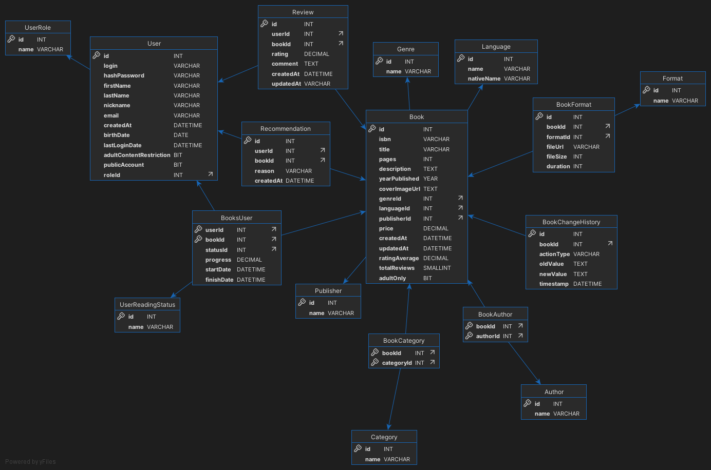

- [ВВЕДЕНИЕ](#введение)
1. [Теоретические основы разработки информационной системы](#1-теоретические-основы-разработки-информационной-системы)

   1. [Актуальность и мотивы выбора темы](#11-актуальность-и-мотивы-выбора-темы) 
       <!-- - [Почему выбранная тема важна.](#111-почему-выбранная-тема-важна)
       - [Проблемы современного доступа к книгам.](#112-проблемы-современного-доступа-к-книгам) 
       - [Личный и профессиональный интерес.](#113-личный-и-профессиональный-интерес)
       - [Цели разработки.](#114-цели-разработки) -->

   2. [Понятие и виды информационных систем](#12-понятие-и-виды-информационных-систем)
       <!-- - [Определение термина «информационная система»](#121-определение-термина-информационная-система)
       - [Классификация информационных систем](#122-классификация-информационных-систем)
       - [Особенности библиотечных ИС.](#123-особенности-библиотечных-информационных-систем) -->

   3. [Структура и архитектура информационной системы](#13-структура-и-архитектура-информационной-системы)
       <!-- - [Основные компоненты информационной системы](#основные-компоненты-информационной-системы)
       - [Архитектурные подходы](#архитектурные-подходы)
       - [Особенности архитектуры онлайн-библиотек](#особенности-архитектуры-онлайн-библиотек) -->

   4. [Основные этапы разработки информационной системы](#14-основные-этапы-разработки-информационной-системы)
       <!-- - [Жизненный цикл разработки информационной системы](#жизненный-цикл-разработки-информационной-системы)
       - [Методологии разработки](#методологии-разработки) -->

   5. [Обзор технологий, применяемых при разработке](#15-обзор-технологий-применяемых-при-разработке)

   6. [Безопасность и защита информации в ИС](#16-безопасность-и-защита-информации-в-ис)

2. [Проектирование информационной системы](#2-проектирование-информационной-системы)

   1. [Анализ предметной области](#21-анализ-предметной-области)
   2. [Функциональные требования](#22-функциональные-требования)
   3. [Проектирование данных](#23-проектирование-данных)
   4. [Архитектура системы](#24-архитектура-системы)
   5. [Проектирование пользовательского интерфейса](#25-проектирование-пользовательского-интерфейса)
   
3. [Реализация информационной системы](#3-реализация-информационной-системы)

   1. [Настройка проекта и инфраструктуры](#31-настройка-проекта-и-инфраструктуры)
   2. [Реализация API для основных функций](#32-реализация-api-для-основных-функций)
   3. [Разработка фронтенда (Razor Pages)](#33-разработка-фронтенда-razor-pages)
   4. [Рекомендательная система](#34-рекомендательная-система)
   5. [Административная панель](#35-административная-панель)
   6. ~~[Инструменты разработки и методология](#36-инструменты-разработки-и-методология)~~


4. [Тестирование и поддержка информационной системы](#4-тестирование-и-поддержка-информационной-системы) 

   1. [Тестирование системы](#41-тестирование-системы)
   2. [Оценка производительности и масштабируемости](#42-оценка-производительности-и-масштабируемости)
   3. [Анализ полученных результатов](#43-анализ-полученных-результатов)
   4. [Эксплуатация и поддержка](#44-эксплуатация-и-поддержка)
   5. [Перспективы развития](#45-перспективы-развития)

- [ЗАКЛЮЧЕНИЕ](#заключение)
- [Список использованных источников  ](#список-использованных-источников)
- [Приложения](#приложения)

# ВВЕДЕНИЕ

В современную цифровую эпоху информационные технологии оказывают всё большее влияние на способы потребления и распространения знаний. Одной из ключевых тенденций последних лет стало активное развитие онлайн-сервисов, обеспечивающих доступ к книгам, аудиоконтенту и образовательным материалам. Онлайн-библиотеки становятся не только альтернативой традиционным книжным хранилищам, но и мощным инструментом для самообразования, досуга и профессионального роста. Разработка таких систем требует учёта широкого круга факторов: от удобства интерфейса до надежности хранения данных и обеспечения прав доступа.

Проблема, которую решает онлайн-библиотека, заключается в обеспечении круглосуточного и удобного доступа к обширному каталогу цифровых книг и аудиофайлов для широкой аудитории. При этом важно не только предоставить пользователям базовую функциональность - поиск, чтение и прослушивание, - но и расширенные возможности, такие как персональные рекомендации, сохранение прогресса чтения, отзывы, рейтинги и скачивание контента для офлайн-доступа. Также особое внимание должно быть уделено защите авторских прав и удобной системе управления контентом.

Анализ существующих аналогов показывает, что на рынке присутствуют как коммерческие, так и свободные решения, однако многие из них ограничены по функциональности, не обладают гибкостью настройки или не учитывают особенности определённых целевых групп. Некоторые сервисы предоставляют доступ только по подписке или с ограниченным бесплатным контентом, другие - не обеспечивают достаточный уровень взаимодействия с пользователем. Это создаёт предпосылки для разработки новой системы, ориентированной на удобство, доступность и адаптивность.

Целью данного дипломного проекта является создание информационной системы "Онлайн библиотека", предоставляющей доступ к цифровым и аудиокнигам, а также иному образовательному и развлекательному контенту. Система должна обеспечить пользователю интуитивно понятный интерфейс, быстрый поиск, возможность создания персональной коллекции, а также поддержку различных форматов контента. При разработке учитываются требования к безопасности, масштабируемости и простоте развертывания, что делает проект пригодным для дальнейшего развития и внедрения.

Практическая значимость проекта заключается в создании платформы, способной удовлетворить растущие потребности в электронном чтении и прослушивании книг в условиях цифровизации образования, удалённой работы и свободного доступа к знаниям. Разработка и внедрение такой системы может быть востребована в образовательных учреждениях, библиотеках, издательствах и среди частных пользователей, желающих получить современное средство взаимодействия с литературным контентом.


## 1. Теоретические основы разработки информационной системы

### 1.1. Актуальность и мотивы выбора темы

#### 1.1.1. Почему выбранная тема важна.

В условиях стремительного развития цифровых технологий обеспечение доступа к литературным ресурсам через интернет становится одной из ключевых задач современного общества. Тема разработки онлайн-библиотеки как информационной системы отвечает на насущную потребность в эффективных инструментах распространения знаний и литературы. Электронные и аудиокниги позволяют преодолеть географические ограничения — пользователи из удалённых регионов получают равный доступ к самым актуальным изданиям, что способствует выравниванию образовательных и культурных возможностей.

Тенденции устойчивого развития и заботы об экологии делают переход на безбумажные форматы особенно актуальным. Создание электронной библиотеки снижает потребность в печати и доставке физических книг, что ведёт к уменьшению расхода природных ресурсов и выбросов парниковых газов. При этом информационная система обеспечивает централизованное хранение контента и его многократное безопасное копирование, что повышает надёжность сохранения знаний в долгосрочной перспективе.

С учётом роста популярности мобильных устройств и онлайн-сервисов вопрос круглосуточного доступа к библиотечным ресурсам становится приоритетным. Онлайн-библиотека предоставляет пользователям возможность мгновенного поиска и получения нужного материала без привязки ко времени работы традиционных учреждений. Для студентов, исследователей и просто любителей чтения это означает гибкость в планировании учебного или свободного времени, что особенно важно при сочетании учёбы, работы и других обязательств.

Развитие аудиоконтента открывает новые горизонты для охвата аудитории: люди с нарушениями зрения, занятые за рулём или активно занимающиеся спортом могут потреблять литературу в формате аудиокниг. Таким образом, онлайн-библиотека становится более инклюзивной платформой, учитывающей разные потребности пользователей. Интеграция мультимедийных форматов повышает привлекательность ресурса и стимулирует привлечение новых целевых групп.

Наконец, быстрые темпы обновления научной и образовательной литературы требуют современных механизмов управления контентом. Традиционные библиотеки часто сталкиваются с задержками при закупке и каталогизации новых изданий. Информационная система онлайн-библиотеки способна оперативно пополняться электронными версиями свежих исследований, учебников и художественной литературы, обеспечивая пользователям доступ к самой актуальной информации сразу после её публикации. Это критически важно для поддержания конкурентоспособности образовательных учреждений и научных сообществ.

#### 1.1.2. Проблемы современного доступа к книгам.

В городах отмечается перенасыщенность книжных магазинов и библиотек специализированными новинками, но при этом классические и редкие издания зачастую недоступны. Региональные библиотеки испытывают нехватку финансирования, из-за чего многие фонды устаревают, а библиографический каталог плохо обновляется. Жители малых городов и сельской местности лишены возможности выбирать между разными форматами и жанрами: ассортимент ограничен и редко пополняется современными работами. Как следствие, читатель вынужден удовлетворяться тем, что имеется в наличии, либо приобретать книги по завышенным ценам у перекупщиков.

С переходом на цифровые носители ключевым барьером становится техническая оснащённость и навыки пользователей. Не во всех школах и библиотеках есть компьютеры или планшеты, а личные устройства громоздки или морально устарели. Даже при наличии гаджетов многие люди испытывают трудности с установкой специальных программ для чтения и конвертации форматов — интерфейсы часто непонятны, а инструкции сложны. Для людей старшего поколения и тех, кто плохо владеет технологиями, это превращает электронные книги в недоступный формат, вынуждая их отказываться от чтения вовсе.

Ограниченность инструментов для поиска и рекомендаций затрудняет пользователям обнаружение нового и интересного контента. Большинство библиотечных каталогов и сервисов электронных книг предлагает примитивный поиск по названию или автору, но не умеет анализировать предпочтения читателя и предлагать релевантные новые издания. В результате пользователь часто возвращается к знакомым произведениям и жанрам, упуская при этом настоящие жемчужины литературы. Отсутствие интеллектуальных механизмов рекомендаций и плохо структурированные метаданные (например, неполные аннотации или неверно проставленные теги) снижают эффективность навигации по обширным коллекциям. Более того, разрозненность платформ вынуждает регистрироваться и привыкать к разным интерфейсам, что создаёт дополнительный психологический барьер для активного чтения и изучения новых авторов.

#### 1.1.3 Личный и профессиональный интерес.

Мой личный интерес к проекту обусловлен стремлением создать действительно полезный сервис для ценителей книг и аудиоконтента, а для меня он станет возможностью отточить навыки разработки серверной части на ASP.NET Core: реализовать эффективное управление данными через Entity Framework Core и MySQL, внедрить надёжную JWT-аутентификацию и организовать масштабируемое развёртывание в Docker-контейнерах для обеспечения быстрого и безопасного доступа к контенту. Кроме того, проект позволит мне освоить разработку веб-приложений на Razor Pages, узнать особенности интеграции медиасерверов и аудиоплееров и тем самым существенно расширить свой профессиональный опыт.

#### 1.1.4 Цели разработки.

- Создать производительный и масштабируемый RESTful API на базе ASP.NET Core Minimal API.
- Обеспечить надёжную аутентификацию и авторизацию с помощью JWT, а также хеширование персональные данных.
- Реализовать гибкую систему хранения и обработки данных через Entity Framework Core и MySQL с учётом высокой нагрузки.
- Разработать удобный веб-интерфейс на Razor Pages для поиска, чтения и прослушивания контента.
- Внедрить контейнеризованное развёртывание (Docker) и CI/CD-процессы для быстрой доставки обновлений и простого масштабирования.
- Интегрировать рекомендации контента на основе истории пользователей для повышения вовлечённости и удержания аудитории.


### 1.2. Понятие и виды информационных систем

#### 1.2.1. Определение термина «информационная система»

Согласно ГОСТ 34.321-96, информационная система (ИС) — это система, которая организует хранение и манипулирование информацией о предметной области . Это определение подчеркивает, что ИС обеспечивает структурированное хранение, обработку и доступ к данным, относящимся к конкретной области знаний или деятельности.

#### 1.2.2. Классификация информационных систем

Информационные системы можно классифицировать по различным критериям:
По области применения:
- Экономические ИС: предназначены для автоматизации управленческих и учетных функций на предприятиях.
- Медицинские ИС: используются в лечебных учреждениях для ведения медицинской документации и поддержки принятия решений.
- Географические ИС (ГИС): обеспечивают сбор, хранение, анализ и визуализацию пространственно-координированных данных.
- Библиотечные ИС: предназначены для автоматизации процессов, связанных с управлением библиотечными фондами и обслуживанием читателей.

По структуре (архитектуре):
- Локальные (настольные) ИС: все компоненты системы находятся на одном компьютере.
- Распределенные ИС: компоненты системы распределены по нескольким компьютерам, соединенным в сеть.
- Файл-серверные ИС: данные хранятся на сервере, а обработка осуществляется на клиентских машинах.
- Клиент-серверные ИС: обработка данных распределена между сервером и клиентами.
- Многозвенные (многоуровневые) ИС: включают дополнительные уровни, такие как сервер приложений, для обеспечения масштабируемости и гибкости.

По функциональности:
- Оперативные ИС: обеспечивают выполнение повседневных операций организации.
- Аналитические ИС: предназначены для анализа данных и поддержки принятия управленческих решений.
- Информационно-поисковые ИС: обеспечивают хранение и поиск информации по заданным критериям.

#### 1.2.3. Особенности библиотечных информационных систем

Библиотечные информационные системы (БИС) обладают рядом специфических особенностей, обусловленных характером библиотечной деятельности:
- Электронные каталоги: основу БИС составляет система электронных каталогов, содержащих полную информацию об изданиях, хранящихся в библиотечных фондах.
- Полнотекстовые ресурсы: возможность хранения и предоставления доступа к электронным копиям изданий в различных форматах (например, PDF).
- Модульная архитектура: БИС обычно имеют модульную структуру, включающую модули для комплектования фонда, каталогизации, обслуживания читателей, межбиблиотечного абонемента и др.
- Интеграция с интернет-технологиями: современные БИС поддерживают веб-интерфейсы, позволяющие пользователям осуществлять поиск, заказ и доступ к ресурсам через интернет.
- Поддержка стандартов: использование открытых стандартов (например, ISO, ГОСТ, IEEE) обеспечивает совместимость и интероперабельность с другими системами.

Таким образом, библиотечные информационные системы представляют собой специализированные ИС, адаптированные для эффективного управления библиотечными ресурсами и обслуживания пользователей в условиях современной информационной среды.

### 1.3 Структура и архитектура информационной системы

#### Основные компоненты информационной системы

Информационная система онлайн-библиотеки включает в себя следующие ключевые компоненты:
- Пользовательский интерфейс (UI): обеспечивает взаимодействие пользователя с системой через веб-браузер или мобильное приложение. Интерфейс должен быть интуитивно понятным и адаптивным для различных устройств.
- Логика приложения (бизнес-логика): отвечает за обработку пользовательских запросов, реализацию правил доступа, управление сессиями и другие операции, связанные с функционированием системы.
- База данных: хранит информацию о пользователях, книгах, аудиофайлах, метаданных и другой связанной информации.
- Хранилище контента: предназначено для хранения электронных и аудиокниг, изображений и других медиафайлов.
- Сервер приложений: обеспечивает выполнение бизнес-логики и взаимодействие между пользовательским интерфейсом и базой данных.
- Сервер базы данных: управляет хранением, извлечением и обновлением данных в базе данных.
- Сервер хранения файлов: отвечает за хранение и предоставление доступа к медиафайлам.
- Сервер аутентификации: обеспечивает проверку подлинности пользователей и управление их правами доступа.

#### Архитектурные подходы

Клиент-серверная архитектура:

Онлайн-библиотека реализуется по модели клиент-серверной архитектуры, где клиентская часть (фронтенд) взаимодействует с серверной частью (бэкенд) через сеть. Клиентская часть отвечает за отображение интерфейса и отправку запросов, а серверная — за обработку этих запросов и взаимодействие с базой данных и хранилищем контента.

Веб-приложение:

Веб-приложение онлайн-библиотеки представляет собой систему, доступную через веб-браузер без необходимости установки дополнительного программного обеспечения. Это обеспечивает кроссплатформенность и удобство доступа для пользователей. Серверная часть обрабатывает бизнес-логику и взаимодействует с базой данных, а клиентская часть предоставляет интерфейс для пользователей.

#### Особенности архитектуры онлайн-библиотек

Архитектура онлайн-библиотеки должна учитывать специфические требования, такие как:
- Масштабируемость: система должна эффективно обрабатывать большое количество одновременных пользователей и запросов.
- Безопасность: необходимо обеспечить защиту данных пользователей и контента от несанкционированного доступа.
- Доступность: система должна быть доступна круглосуточно с минимальным временем простоя.
- Управление правами доступа: разграничение прав пользователей (например, читатели, библиотекари, - Поддержка различных форматов контента: система должна обрабатывать и предоставлять доступ к различным форматам электронных и аудиокниг.

Для реализации этих требований может быть использована трехуровневая архитектура, включающая:
- Уровень представления: веб-интерфейс или мобильное приложение для взаимодействия с пользователями.
- Уровень приложений: серверная часть, обрабатывающая бизнес-логику и взаимодействие с базой данных.
- Уровень данных: база данных и хранилище контента, обеспечивающие хранение и доступ к информации.

Такой подход обеспечивает модульность, упрощает масштабирование и поддержку системы, а также повышает ее надежность и безопасность.

### 1.4 Основные этапы разработки информационной системы

#### Жизненный цикл разработки информационной системы

Жизненный цикл разработки информационной системы (ИС) — это совокупность стадий, через которые проходит система от первоначальной идеи до полного завершения эксплуатации. Он включает все процессы, связанные с планированием, созданием, тестированием, внедрением и сопровождением системы.

В классическом понимании жизненный цикл ИС состоит из следующих основных стадий:

1. Инициирование (постановка задачи). На этом этапе определяется цель создания системы, её основные функции и ожидаемые результаты. Формируются общие требования к системе, а также выявляются заинтересованные стороны (пользователи, заказчики, разработчики). Для онлайн-библиотеки, например, это может быть обеспечение доступа к цифровым книгам, управление коллекцией, учёт пользователей и т.д.
2. Анализ требований. Проводится глубокий анализ предметной области, изучаются существующие аналоги и выявляются их недостатки. Определяются функциональные и нефункциональные требования к системе. Разрабатываются сценарии использования, составляется техническое задание. Этот этап позволяет точно понять, какую проблему должна решить система и как она должна работать.
3. Проектирование. На основе анализа создаётся архитектура системы: разрабатываются модели данных, структура баз данных, логика взаимодействия компонентов, интерфейс пользователя. Для сложных систем также разрабатываются схемы безопасности, масштабируемости и отказоустойчивости. Этот этап служит фундаментом для последующей реализации.
4. Реализация (программирование). Переход к непосредственной разработке программного обеспечения. Разработчики пишут код, создают базы данных, настраивают серверную часть, подключают внешние сервисы. В случае онлайн-библиотеки реализуются модули авторизации, поиска книг, прослушивания аудиоконтента и другие функции.
5. Тестирование. Проверяется соответствие системы требованиям, проводится отладка и устранение ошибок. Используются различные виды тестирования: модульное, интеграционное, системное, нагрузочное и пользовательское. Цель — убедиться, что система работает корректно, стабильно и безопасно.
6. Внедрение. Система развёртывается в рабочем окружении, проводится обучение пользователей и администраторов, осуществляется перенос данных, если это необходимо. После этого система становится доступной для использования конечными пользователями.
7. Сопровождение и развитие — после запуска система требует технической поддержки, обновлений, адаптации к новым требованиям и условиям.

Жизненный цикл может быть линейным или итеративным, в зависимости от выбранной методологии. Выбор подхода определяется сложностью проекта, доступными ресурсами и требованиями заказчика.

#### Методологии разработки

1. Каскадная модель (Waterfall)

   Описание: линейная, последовательная методика, где каждый этап (анализ, проектирование, реализация, тестирование, внедрение) завершён полностью перед переходом к следующему.

   Преимущества: чёткая структура, легко планировать ресурсы и сроки, понятная документация.

   Недостатки: плохая адаптация к изменениям требований, высокая стоимость исправлений на поздних этапах.

2. Итеративная модель
   
   Описание: разработка идёт в циклах (итерациях). Каждая итерация включает полный цикл от анализа до тестирования, после чего полученный результат оценивают и дорабатывают в следующей итерации.

   Преимущества: ранняя проверка ключевых функций, гибкость при изменении требований, постепенное наращивание функционала.

   Недостатки: сложнее прогнозировать окончательные сроки и бюджет, может потребоваться дополнительная работа над общей архитектурой.

3. Гибкая методология (Agile)

   Описание: набор практик и принципов (Scrum, Kanban, XP и др.), основанных на итеративной и инкрементальной разработке с сильным акцентом на коммуникацию, частые демонстрации заказчику и адаптацию к изменениям.

   Преимущества: высокая реакция на изменения, регулярные релизы рабочего ПО, плотное взаимодействие команды и заказчика.

   Недостатки: нужен дисциплинированный и опытный коллектив, возможны трудности с оценкой окончательных сроков и объёма работ.

### 1.5 Обзор технологий, применяемых при разработке

При разработке информационной системы онлайн-библиотеки важным этапом является выбор подходящих технологий, которые обеспечат надежность, масштабируемость и удобство поддержки программного продукта. В рамках данного проекта используются современные языки программирования, фреймворки и системы управления базами данных (СУБД), а также инструменты контейнеризации и веб-разметки, обеспечивающие гибкость и эффективность разработки.

Основным языком программирования, используемым в проекте, является C#. Это объектно-ориентированный язык, разработанный компанией Microsoft и получивший широкое распространение в корпоративной разработке. Он обеспечивает высокий уровень безопасности типов, мощные средства работы с памятью и богатый инструментарий для построения как серверной, так и клиентской логики. В сочетании с .NET-платформой C# предоставляет разработчику широкий выбор библиотек и инструментов.

Для создания серверной части веб-приложения применяется ASP.NET Core, современный кроссплатформенный веб-фреймворк от Microsoft. Он позволяет создавать производительные и масштабируемые веб-сервисы и API. В частности, в проекте используется подход Minimal API, который позволяет быстро создавать компактные и читаемые маршруты, особенно подходящие для RESTful-сервисов. Это решение облегчает разработку и снижает уровень входа для начинающих разработчиков, при этом не ограничивая возможности масштабирования проекта.

Интерфейс пользователя реализуется с использованием Razor Pages — технологии, предоставляющей удобную модель для построения веб-интерфейсов без необходимости использования JavaScript-фреймворков. Razor Pages интегрируется непосредственно в ASP.NET Core, что упрощает обработку данных и реализацию логики на сервере. Визуальная составляющая оформляется с помощью HTML и препроцессора стилей Sass, который расширяет возможности CSS и облегчает управление стилями в крупных проектах за счёт вложенности, переменных и миксинов.

В качестве системы управления базами данных выбрана MySQL, одна из самых популярных реляционных СУБД с открытым исходным кодом. Она обеспечивает высокую производительность, надёжность и простоту администрирования. Для взаимодействия с базой данных используется Entity Framework Core — ORM-библиотека, предоставляющая высокоуровневый способ работы с данными в виде объектов, минимизируя необходимость написания SQL-запросов вручную.

Для развертывания и тестирования проекта применяется Docker — инструмент контейнеризации, позволяющий упаковать приложение и все его зависимости в единый контейнер. Это упрощает развертывание на различных средах (локальной, тестовой, продуктивной) и повышает воспроизводимость сборки. С помощью Docker можно обеспечить быструю настройку окружения и автоматизацию развертывания, что особенно важно в условиях разработки командой или при публикации проекта на сервер.

В совокупности все перечисленные технологии образуют мощную и современную технологическую базу, которая позволяет создать качественный, гибкий и расширяемый веб-сервис для онлайн-библиотеки. Такой подход обеспечивает как удобство разработки, так и комфортное использование системы конечными пользователями.

### 1.6 Безопасность и защита информации в ИС.

Безопасность и защита информации в онлайн-библиотеке — критически важный аспект, напрямую влияющий на надежность сервиса, доверие пользователей и соответствие законодательным требованиям. Современные информационные системы сталкиваются с множеством угроз: от утечек персональных данных до атак на доступность сервиса. В силу растущей популярности электронных и аудиокниг, а также других цифровых форматов контента, обеспечение целостности, конфиденциальности и доступности информации становится приоритетом на всех этапах жизненного цикла системы.

Первой и одной из ключевых групп рисков при работе с персональными данными является несанкционированный доступ. Пользовательские аккаунты, платежная информация и прочие сведения о подписках могут быть похищены при успешной атаке злоумышленников, использующих фишинг, подбор паролей или уязвимости в приложениях. Нарушение целостности данных (например, изменение профиля пользователя или истории чтения) способно подорвать логику рекомендательных механизмов, а потеря данных ведёт к нарушению контрактных обязательств перед заказчиками и регуляторами.

Для борьбы с несанкционированным доступом в системе вводится многоуровневая аутентификация. Классический пример — проверка логина и пароля, дополненная одноразовыми кодами (2FA). Авторизация реализуется через токены доступа, наиболее популярными из которых являются JWT (JSON Web Token). JWT позволяют хранить в себе информацию о правах пользователя в зашифрованном виде, легко масштабируются и интегрируются с REST API: при каждом запросе сервер проверяет подпись токена и права, что существенно упрощает управление сессиями в распределенной архитектуре.

Шифрование данных обеспечивает их безопасность как при передаче, так и при хранении. Для защиты каналов связи между клиентом и сервером применяется протокол TLS (HTTPS), исключающий возможность «прослушки» и подмены трафика. На уровне базы данных используются алгоритмы симметричного (AES) и асимметричного (RSA) шифрования: чувствительные поля (например, адрес электронной почты, телефон) хранятся в виде шифртекста, а ключи доступа надёжно изолированы. Кроме того, применение хеширования паролей (bcrypt, Argon2) гарантирует, что в случае утечки БД злоумышленники не смогут восстановить исходные пароли.

Резервное копирование и восстановление — не менее важная часть стратегии информационной безопасности. Регулярное создание бэкапов базы данных, конфигурационных файлов и пользовательского контента позволяет минимизировать потери при аппаратных сбоях, программных ошибках или целенаправленных атаках типа «вымагательство» (ransomware). Оптимальным считается применение принципа «3-2-1»: три копии данных на двух типах носителей и одна — вне основной площадки (облако или офлайн-архив), с контролем целостности и циклической проверкой пригодности резервов.

Актуальность обеспечения безопасности в онлайн-сервисах особенно высока в условиях жесткой конкуренции и постепенного ужесточения законодательства (GDPR, Закон «О персональных данных» в РФ). Пользователи всё более критично относятся к защите своей информации и готовы переключаться на другие платформы при малейших признаках ненадёжности. Инвесторы и партнёры также оценивают зрелость процессов безопасности при выборе проектов для финансирования. Таким образом, внедрение современных методов защиты не только снижает риски, но и повышает конкурентоспособность онлайн-библиотеки на рынке цифровых услуг.


## 2. Проектирование информационной системы

### 2.1. Анализ предметной области

ИС «Онлайн-библиотека» ориентирована на широкий круг пользователей, заинтересованных в доступе к электронным и аудиокнигам, а также к другому образовательному и развлекательному контенту. Выделение целевой аудитории необходимо для более точного определения требований к функционалу системы, интерфейсу, способам доступа и структуре контента.

На основе анализа потенциальных пользователей можно выделить следующие основные группы целевой аудитории:

1. Студенты и учащиеся — одна из ключевых категорий пользователей, использующих библиотечные ресурсы для учебных целей. Им необходим доступ к учебной и научной литературе, возможностям быстрого поиска, закладкам, сохранению прочитанного материала и скачиванию книг в различных форматах.
2. Преподаватели и научные сотрудники — нуждаются в специализированной литературе, монографиях, научных статьях и методических пособиях. Для них важна возможность расширенного поиска, составления подборок, цитирования и интеграции с другими образовательными ресурсами.
3. Широкая читательская аудитория — включает пользователей, заинтересованных в чтении художественной, публицистической, мотивационной и иной литературы в электронном или аудиоформате. К этой группе относятся взрослые пользователи, использующие систему для досуга и саморазвития. Здесь важны функции персонализированных рекомендаций, системы рейтингов, рецензий и удобный интерфейс.
4. Пользователи с ограниченными возможностями (в первую очередь по зрению) — нуждаются в доступном интерфейсе и адаптированном контенте, таком как аудиокниги или поддержка экранных читалок (screen reader). Это требует соблюдения принципов цифровой доступности при проектировании интерфейса.
5. Родители и дети — отдельная категория пользователей, заинтересованных в детской литературе, сказках и развивающих материалах. Для них актуальна возможность фильтрации по возрасту, наличие аудиоформата и визуальных материалов (иллюстраций, обложек и т. п.).
6. Работающие специалисты — заинтересованы в профессиональной, научно-популярной и бизнес-литературе. Удобство мобильного доступа, возможность слушать аудиокниги в дороге, а также подборки по тематикам — ключевые требования этой группы.

| №  | Название сценария              | Описание                                                                 | Участник (роль)               | Результат                                      |
|----|-------------------------------|--------------------------------------------------------------------------|-------------------------------|------------------------------------------------|
| 1  | Регистрация пользователя       | Пользователь заполняет форму регистрации и создаёт аккаунт               | Гость                         | Создан новый пользовательский профиль         |
| 2  | Авторизация                    | Пользователь вводит логин и пароль для входа в систему                   | Зарегистрированный пользователь | Получен доступ к личному кабинету              |
| 3  | Поиск книги                    | Пользователь вводит ключевые слова или фильтры для поиска книги          | Любая роль                     | Отображён список книг по заданным критериям   |
| 4  | Просмотр описания книги        | Пользователь открывает карточку книги                                    | Любая роль                     | Отображена подробная информация о книге       |
| 5  | Прослушивание аудиокниги       | Пользователь запускает аудиоплеер для выбранной книги                    | Зарегистрированный пользователь | Начато прослушивание книги                    |
| 6  | Чтение электронной книги       | Пользователь открывает электронную книгу в онлайн-читалке                | Зарегистрированный пользователь | Книга доступна для чтения онлайн              |
| 7  | Добавление книги в закладки    | Пользователь отмечает книгу как «Читаю», «Прочитал», «Хочу прочитать»    | Зарегистрированный пользователь | Книга добавлена в соответствующую категорию   |
| 8  | Оставление отзыва/оценки       | Пользователь пишет отзыв или ставит оценку книге                         | Зарегистрированный пользователь | Отзыв сохранён, оценка учтена в рейтинге      |
| 9  | Загрузка книги                 | Пользователь скачивает книгу (если это разрешено)                        | Зарегистрированный пользователь | Файл книги загружен                           |
| 10 | Управление контентом           | Администратор добавляет, редактирует или удаляет книги                   | Администратор                 | Обновлённый каталог книг                      |
| 11 | Управление пользователями      | Администратор блокирует/разблокирует пользователей                       | Администратор                 | Изменён статус учетной записи                 |
| 12 | Просмотр рекомендаций          | Пользователь просматривает персональные рекомендации на основе истории   | Зарегистрированный пользователь | Сформирован список рекомендованных книг       |
| 13  | Просмотр истории чтения            | Пользователь открывает список ранее прочитанных или начатых книг         | Зарегистрированный пользователь  | Отображена персональная история чтения           |
| 14  | Управление профилем                | Пользователь редактирует личные данные, пароль или настройки уведомлений | Зарегистрированный пользователь  | Обновлён профиль пользователя                    |
| 15  | Жалоба на контент или отзыв        | Пользователь подаёт жалобу на неподобающий контент                       | Зарегистрированный пользователь  | Жалоба зарегистрирована, передана администратору |
| 16  | Модерация отзывов                  | Администратор проверяет и при необходимости удаляет некорректные отзывы  | Администратор                    | Удалён или одобрен пользовательский отзыв        |
| 17  | Добавление книги в избранное       | Пользователь сохраняет книгу в список избранных                         | Зарегистрированный пользователь  | Книга добавлена в избранное                      |
| 18  | Просмотр популярных книг           | Пользователь открывает раздел с самыми читаемыми/оценёнными книгами      | Любая роль                       | Сформирован список популярных книг               |
| 19  | Использование расширенного поиска  | Пользователь применяет фильтры по жанру, автору, году, формату и т.д.    | Любая роль                       | Результаты поиска соответствуют заданным фильтрам|
| 20  | Восстановление пароля              | Пользователь запрашивает сброс пароля по электронной почте               | Гость                            | Получено письмо со ссылкой на восстановление     |
| 21  | Просмотр категории или жанра       | Пользователь просматривает книги в определённой категории                | Любая роль                       | Отображены книги по жанру или тематике           |
| 22  | Комментирование книги              | Пользователь оставляет комментарий к книге                              | Зарегистрированный пользователь  | Комментарий отображается на странице книги       |
| 23  | Получение уведомлений              | Пользователь получает уведомления о новых книгах или событиях            | Зарегистрированный пользователь  | Уведомление отображено или отправлено по email   |

### 2.2. Функциональные требования

- Требования к пользовательским ролям
  - Reader: просмотр, поиск, запросы на выдачу
  - Librarian: подтверждение выдачи/возврата, работа с заявками
  - Administrator: CRUD для объектов системы, управление пользователями
- Нефункциональные требования
  - Производительность (быстрый поиск)
  - Масштабируемость (горизонтальное и вертикальное)
  - Безопасность (защита от SQL-инъекций, XSS, CSRF)
  - Удобство и доступность интерфейса (адаптивность)

### 2.3. Проектирование данных



| Сущность              | Атрибуты                                                                                                                                                                                                 | Связи                                                                                     | Тип связи                         |
| --------------------- | -------------------------------------------------------------------------------------------------------------------------------------------------------------------------------------------------------- | ----------------------------------------------------------------------------------------- | --------------------------------- |
| **Author**            | `id`, `name`                                                                                                                                                                                             | ↔ `Book` через `BookAuthor(bookId, authorId)`                                             | многие-ко-многим                  |
| **Category**          | `id`, `name`                                                                                                                                                                                             | ↔ `Book` через `BookCategory(bookId, categoryId)`                                         | многие-ко-многим                  |
| **Format**            | `id`, `name`                                                                                                                                                                                             | ↔ `Book` через `BookFormat(bookId, formatId)`                                             | многие-ко-многим                  |
| **Genre**             | `id`, `name`                                                                                                                                                                                             | ← `Book(genreId)`                                                                         | один-ко-многим                    |
| **Language**          | `id`, `name`, `nativeName`                                                                                                                                                                               | ← `Book(languageId)`                                                                      | один-ко-многим (nullable)         |
| **Publisher**         | `id`, `name`                                                                                                                                                                                             | ← `Book(publisherId)`                                                                     | один-ко-многим                    |
| **UserReadingStatus** | `id`, `name`                                                                                                                                                                                             | ← `BooksUser(statusId)`                                                                   | один-ко-многим                    |
| **UserRole**          | `id`, `name`                                                                                                                                                                                             | ← `User(roleId)`                                                                          | один-ко-многим                    |
| **User**              | `id`, `login`, `hashPassword`, `firstName`, `lastName`, `nickname`, `email`, `createdAt`, `birthDate`, `lastLoginDate`, `adultContentRestriction`, `publicAccount`, `roleId`                             | ↔ `Book` через `BooksUser`, ↔ `Review`, ↔ `Recommendation`                                | многие-ко-многим, один-ко-многим  |
| **Book**              | `id`, `isbn`, `title`, `pages`, `description`, `yearPublished`, `coverImageUrl`, `genreId`, `languageId`, `publisherId`, `price`, `createdAt`, `updatedAt`, `ratingAverage`, `totalReviews`, `adultOnly` | ↔ `Author`, `Category`, `Format`, `User`, `Review`, `Recommendation`, `BookChangeHistory` | один-ко-многим / многие-ко-многим |
| **BookAuthor**        | `bookId`, `authorId`                                                                                                                                                                                     | → `Book`, → `Author`                                                                      | таблица связей (м-м)              |
| **BookCategory**      | `bookId`, `categoryId`                                                                                                                                                                                   | → `Book`, → `Category`                                                                    | таблица связей (м-м)              |
| **BookFormat**        | `id`, `bookId`, `formatId`, `fileUrl`, `fileSize`, `duration`                                                                                                                                            | → `Book`, → `Format`                                                                      | таблица связей (м-м с данными)    |
| **BookChangeHistory** | `id`, `bookId`, `actionType`, `oldValue`, `newValue`, `timestamp`                                                                                                                                        | → `Book`                                                                                  | один-ко-многим                    |
| **BooksUser**         | `userId`, `bookId`, `statusId`, `progress`, `startDate`, `finishDate`                                                                                                                                    | → `User`, `Book`, `UserReadingStatus`                                                     | многие-ко-многим + статус         |
| **Review**            | `id`, `userId`, `bookId`, `rating`, `comment`, `createdAt`, `updatedAt`                                                                                                                                  | → `User`, → `Book`                                                                        | один-ко-многим                    |
| **Recommendation**    | `id`, `userId`, `bookId`, `reason`, `createdAt`                                                                                                                                                          | → `User`, → `Book`                                                                        | один-ко-многим                    |

### 2.4. Архитектура системы

- Общая схема взаимодействия компонентов
  - Клиент (Razor Pages) ↔ API (Minimal API) ↔ MySQL
- Слои приложения:
  - Presentation Layer (Razor Pages)
  - Business Logic Layer (сервисы и приложения)
  - Data Access Layer (Entity Framework Core или Dapper)
- JWT Authentication Middleware
- CI/CD-пайплайн и окружения (Dev/Prod)

### 2.5. Проектирование пользовательского интерфейса

- Основные макеты страниц в виде wireframe:
  - Главная страница с поиском
  - Страница книги с описанием и кнопками "Выдать/Вернуть"
  - Личный кабинет читателя
  - Административная панель: список объектов, формы редактирования
  - Страница рекомендаций
- Принципы навигации и UX

## 3. Реализация информационной системы

### 3.1. Настройка проекта и инфраструктуры

- Создание .NET 8 проекта с Minimal API
- Конфигурация подключений к MySQL
- Настройка SCSS-компиляции и Razor Pages
- Организация структуры папок и модулей

### 3.2. Реализация API для основных функций

- Поиск книг (GET /api/books?query=...)
- Получение информации о книге (GET /api/books/{id})
- Выдача книги (POST /api/loans)
- Возврат книги (PUT /api/loans/{id}/return)
- Маршрутизация, модели DTO и маппинг
- Обработка ошибок и валидация входных данных

### 3.3. Разработка фронтенда (Razor Pages)

- Страницы поиска и результатов
- Отображение деталей книги и кнопок действий
- Форма регистрации/входа через JWT
- Хранение токена на клиенте и межстраничная навигация

### 3.4. Рекомендательная система

- Описание алгоритма: content-based filtering на основе жанров и авторов
- Расчет вектора профиля пользователя и векторов книг
- Реализация сервиса рекомендаций в BLL
- API-эндпоинт для получения рекомендаций (GET /api/recommendations)
- Интеграция рекомендаций на фронтенде

### 3.5. Административная панель

- CRUD для сущностей: Book, Author, Genre, Publisher, User
- Реализация API-эндпоинтов (AdminController)
- UI для админа: таблицы, формы, валидация
- Защита админских маршрутов (роль Administrator)

### 3.6. Инструменты разработки и методология

- Использование Git, ветвления и code review
- Покрытие тестами: unit-тесты для BLL, интеграционные тесты API
- Документирование API (Swagger/OpenAPI)

## 4. Тестирование и поддержка информационной системы

### 4.1. Тестирование системы

- Функциональное тестирование всех модулей
- Нагрузочное тестирование поиска и выдачи книг
- Тестирование безопасности (SQL-инъекции, XSS, CSRF)

### 4.2. Оценка производительности и масштабируемости

- Метрики: время ответа API, средняя загрузка БД
- Результаты тестирования под нагрузкой
- Выводы о возможностях масштабирования (репликация MySQL, кэширование)

### 4.3. Анализ полученных результатов

- Сравнение с целями и задачами проекта
- Достижения и ограничения разработанной системы

### 4.4. Эксплуатация и поддержка

- Ведение логов и мониторинг
- Обновления и деплой новых версий
- Поддержка пользователей
- Документация и сопровождение

### 4.5. Перспективы развития

- Интеграция с внешними сервисами (ISBN, Google Books API)
- Расширение рекомендательной системы (коллаборативная фильтрация)
- Мобильное приложение на Blazor или MAUI
- Международные версии (i18n)

# Заключение

- Общие итоги выполненной работы
- Основные выводы
- Значимость проекта и его возможное применение

# Перечень сокращений

# Список использованных источников

# Приложения

- Схемы БД и диаграммы
- Wireframe макеты
- Примеры API-запросов и ответов
- Список использованных источников и литературы


-----------

```MD
#### 1.1.1. Обоснование потребностей современного образования и научной среды

В современных условиях динамичного развития информационно-коммуникационных технологий образовательные и научные учреждения остро нуждаются в оперативном и беспрепятственном доступе к широкому спектру учебных и научных материалов. Традиционные печатные фонды, располагающиеся в отдельных зданиях и филиалах, не всегда способны обеспечить требуемую скорость поиска и получения информации, особенно при необходимости задействования межбиблиотечного обмена или при работе с редкими изданиями. В свою очередь, интеграция онлайн-библиотек позволяет преодолеть территориальные и временные барьеры, создавая единое виртуальное пространство хранения и распространения знаний.

Рост интердисциплинарных исследований и межвузовских коллабораций усиливает потребность в централизованном доступе к разнообразным источникам. Ученые и студенты, работающие над комплексными проектами, нуждаются не только в узкопрофильных публикациях, но и в материалах смежных отраслей, что затрудняет поиск информации в рамках локальных фондов. Онлайн-библиотека способна концептуально объединить ресурсы разных учреждений, предоставив единую точку входа для поиска и загрузки электронных документов, что значительно ускоряет исследовательские процессы и повышает качество научных результатов.

Современный образовательный процесс всё более ориентируется на смешанное и дистанционное обучение, требуя гибких инструментов поддержки. Электронные курсы, вебинары, виртуальные лаборатории и мультимедийные пособия становятся неотъемлемой частью учебных программ, и их интеграция с онлайн-библиотекой позволяет обеспечить комплексность образовательной среды. Возможность моментального перехода от теоретической лекции к изучению соответствующих статей или глав монографий повышает мотивацию и эффективность усвоения знаний, а также способствует развитию навыков самостоятельного поиска и критического анализа информации.

Важным аспектом является также увеличивающийся объём цифровых ресурсов: ежегодно создаются сотни тысяч новых статей, книг и учебных пособий в электронном формате. Рост числа пользователей, в том числе международных, создаёт нагрузку на традиционные серверные решения и локальные сети библиотек. Онлайн-система, спроектированная с учётом масштабируемой архитектуры и распределённого хранения данных, обеспечивает стабильный доступ и высокую производительность вне зависимости от количества одновременно подключённых пользователей.

Наконец, для научной среды критично соблюдение стандартов цитирования, лицензирования и сохранности авторских прав. Информационная система онлайн-библиотека может включать механизмы автоматического формирования библиографических ссылок, отслеживания легальности распространения материалов и обеспечения долгосрочного архивного хранения. Это позволяет не только упростить работу исследователей при оформлении публикаций, но и снизить юридические риски для организаций-правообладателей и пользователей.

#### 1.1.2. Увеличение объёма цифровых ресурсов и роста числа пользователей

Расширение электронного контента в современной научно-образовательной среде отмечается ежегодным многократным приростом числа доступных изданий, статей, отчётов и мультимедийных материалов. Переход крупных научных журналов и издательств на полностью цифровую или гибридную модель публикации, активное внедрение репозиториев открытого доступа и рост числа электронных монографий приводят к тому, что объёмы информации, подлежащей учёту, хранению и распространению, удваиваются каждые несколько лет. Это требование объёма контента диктует необходимость использования эффективных алгоритмов сжатия, индексирования и репликации данных для обеспечения быстрого извлечения и надёжного резервного копирования.

Параллельно наблюдается стремительный рост пользовательской аудитории: студенты и преподаватели ищут литературу вне стен библиотеки, научные сотрудники обмениваются данными с партнёрами по всему миру, а внимание уделяется не только традиционным текстовым документам, но и видео-, аудио- и интерактивным материалам. Увеличение числа пользователей обуславливает перераспределение нагрузки на инфраструктуру системы, что требует проектирования масштабируемой архитектуры, позволяющей гибко наращивать ресурсы серверов, сетевых каналов и систем хранения данных без потери производительности.

С точки зрения пользователей, наличие большого количества ресурсов предполагает высокую точность и релевантность поиска. Рост коллекций электронных документов порождает проблемы «шумного» поиска и информационного перенасыщения. Для решения этих задач необходимо введение продвинутых механизмов ранжирования (на основе семантического анализа, машинного обучения и пользовательских предпочтений), а также внедрение многоуровневой системы фильтрации по типу материала, языку, дате публикации и дисциплине.

Увеличение числа одновременных подключений к системе – будь то массовые запросы студентов во время сессий или пиковые нагрузки при выходе новых выпусков журналов – предъявляет повышенные требования к надёжности распределённых сервисов. Использование балансировщиков нагрузки, кластерных решений для баз данных и кэширующих прокси-серверов становится обязательным элементом архитектуры, позволяющим обеспечить непрерывность работы и удовлетворительный отклик на запросы даже в периоды максимальной активности.

Таким образом, устойчивый рост цифровых коллекций и постоянно расширяющаяся аудитория пользователей обосновывают необходимость разработки информационной системы онлайн-библиотеки с учётом её горизонтального масштабирования, интеллектуальных механизмов поиска и гибкой инфраструктуры. Только при комплексном подходе к управлению большими объёмами данных и нагрузкой системы можно обеспечить качество обслуживания, отвечающее высоким требованиям современной науки и образования.

#### 1.1.3. Преимущества онлайн-библиотек перед традиционными хранилищами

Во-первых, ключевым преимуществом онлайн-библиотек является круглосуточный и бесперебойный доступ к электронным ресурсам из любой точки с подключением к Интернету. В отличие от физической библиотеки, где рабочие часы ограничены, пользователь онлайн-системы может ознакомиться с нужными материалами в любое удобное время, что особенно важно для международных научных коллективов и студентов, проживающих в разных часовых поясах. Это устраняет географические барьеры и сокращает задержки, связанные с ожиданием межбиблиотечного абонемента.

Во-вторых, онлайн-библиотека позволяет существенно экономить физическое пространство и издержки на содержание помещений. Традиционные хранилища требуют аренды или строительства площадей для стеллажей, создания специальных условий микроклимата и пожарной безопасности, а также привлечения большого штата обслуживающего персонала. Электронные коллекции, размещённые на серверах или в «облаке», требуют лишь администрирования ИТ-инфраструктуры и периодического обновления программного обеспечения, что в долгосрочной перспективе снижает эксплуатационные расходы.

В-третьих, цифровой формат открывает широкие возможности для работы с разнородными типами контента: текстовыми документами, графиками, видео- и аудиозаписями, интерактивными тестами и обучающими тренажёрами. Интеграция мультимедиа в единое хранилище повышает вовлечённость пользователей и удовлетворяет потребности разных типов восприятия информации, что способствует более глубокому усвоению учебного материала и расширяет инструментарий исследователя.

Четвёртое преимущество — персонализация пользовательского опыта и аналитика поведения. Онлайн-системы могут отслеживать историю поиска, предпочтения и часто просматриваемые темы, что позволяет рекомендовать релевантные публикации и оптимизировать навигацию по каталогу. Кроме того, сбор статистики по использованию ресурсов помогает библиотекарям и администраторам корректировать политику закупок и лицензирования, ориентируясь на реальные потребности аудитории.

Наконец, преимущества онлайн-библиотек проявляются в их способности легко интегрироваться с другими информационными системами образовательных учреждений: электронными дневниками, портальными решениями для дистанционного обучения (LMS), научными репозиториями и системами управления публикациями. Такая сетевая экосистема обеспечивает сквозной доступ к материалам на всех этапах образовательного процесса и научных исследований, упрощает администрирование и повышает общую эффективность образовательных и научных сервисов.
```

-----------